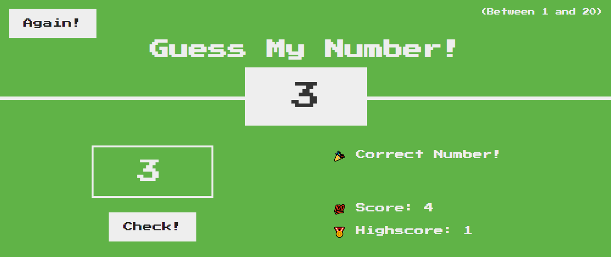
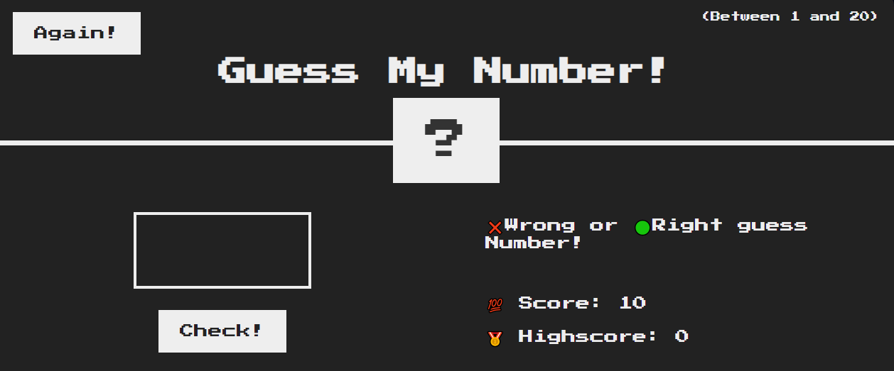

#  Guess the number game

Guess the number game is a game
is a challange  that I have complete from jonas.io cource 
the Challenge teaches you how to minipulate the DOM elements and set the contents back to default this challange also introduces refactoring of JS vanilla.

## How to use

1. By default a random number is already loaded when the web page opens, all you need to do is insert a number in the number box and click "check"

2. Notice to the right, where it says score. Meaning you have have 10 attempts to guess the number correctly. When all attempts finish the game ends.

3. Also on the right hand side you have the "highest score" telly from this it keeps count of how many times you've guessed correct.

4. As stated once all chances are used up, on the top left corner click again to start the game oveer.

Note:If perhaps you've given up and want the answer to the mystery number. Open the Web browser console and see the logs. You will find the number. insert it into the answer box ad see the web page change.

# How it should look like

Access the demo <a herf="HTTPS://MONNUS.GITHUB.IO/GUESSNUMBERTS/" target="_blank" alt="Preview of app"> here.</a>

